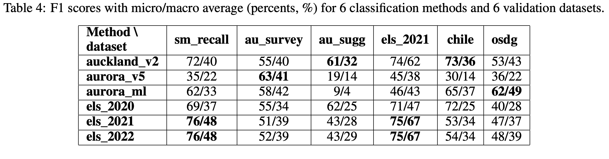
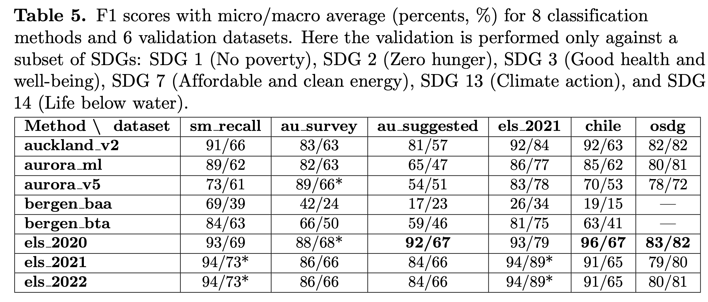
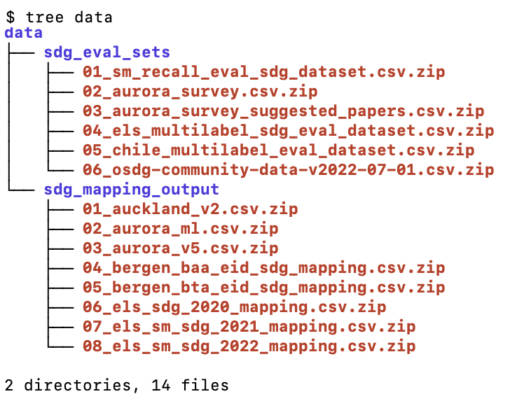

# sdg\_mapping\_queries\_n\_ml\_benchmarks

This code reproduces benchmarking experiments presented in Tables 4 and 5 of the paper "Identifying research supporting the United Nations Sustainable Development Goals" – [ArXiv](https://arxiv.org/abs/2209.07285), under consideration at PLOS ONE.





## Instructions

1. **"Getting data"**: the data is shared via [ICSR Lab](https://www.elsevier.com/icsr/icsrlab). ICSR Lab is intended for scholarly research only and is a cloud-based computational platform which enables researchers to analyze large structured datasets, including aggregated data from Scopus author profiles, PlumX Metrics, SciVal Topics, and [Peer Review Workbench](https://www.elsevier.com/connect/new-dataset-offers-unique-insights-into-peer-review). Upon successful [application](https://www.elsevier.com/icsr/icsrlab/how-to-apply), download the data from ICSR Lab and put it in the `data` folder so that the file structure looks like this: <br><br>


1. **Managing dependencies:** The code is run with Python 3.10 and only needs Pandas >= 1.4.3. You can either install the dependency manually with `pip` or run `poetry install` to install the dependencies in a virtual environment managed by [Poetry](https://python-poetry.org/docs/basic-usage/) which is a modern tool for dependency management and packaging in Python.

1. **Reproducing the results**. To get metrics for a particular SDG mapping dataset (e.g. "Elsevier 2022 SDG mapping") and a particular evaluation dataset (e.g. "Elsevier multi-label SDG dataset") you can run the following command:

```bash
poetry run python sdg_mapping_queries_n_ml_benchmarks/validate_query_output_vs_val_set.py \
--path_to_query_output data/sdg_mapping_output/06_els_sm_sdg_2022_mapping.csv.zip \
--path_to_val_set data/sdg_eval_sets/04_els_multilabel_sdg_eval_dataset.csv.zip
``` 
This will print precision, recall, F1 by SDGs along with their micro- and macro-averaged values:

```
{
 'f1_macro': 0.6720051335779433,
 'f1_micro': 0.7751455531017868,
 'precision_macro': 0.5943059123378011,
 'precision_micro': 0.6870106761565836,
 'recall_macro': 0.8053484586016316,
 'recall_micro': 0.8892215568862275
}
```

The first 2 lines stand for the values presented in Table 4 of the paper: micro- and macro-averaged F1 scores. 

In case of Bergen queries which are limited to a subset of SDGs, you need to pass and additional `--sdgs_to_consider` argument, e.g.

```bash
poetry run python sdg_mapping_queries_n_ml_benchmarks/validate_query_output_vs_val_set.py\
 --path_to_query_output data/sdg_mapping_output/05_bergen_bta_eid_sdg_mapping.csv.zip \
 --path_to_val_set data/sdg_eval_sets/01_sm_recall_eval_sdg_dataset.csv.zip \
 --sdgs_to_consider 1 2 3 7 13 14
```
which outputs:

```
{
'f1_macro': 0.6282726118299791,
 'f1_micro': 0.8377430399812784,
 'precision_macro': 0.5560439245838593,
 'precision_micro': 0.7835066051747049,
 'recall_macro': 0.8868996686880991,
 'recall_micro': 0.9000466931660361
}
```