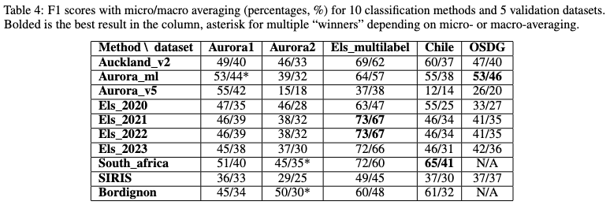

# sdg\_mapping\_queries\_n\_ml\_benchmarks

This code reproduces benchmarking experiments presented in Tables 4 and 5 of the paper "Identifying research supporting the United Nations Sustainable Development Goals" – [ArXiv](https://arxiv.org/abs/2209.07285), under consideration at QSS.




## Instructions

1. **"Getting data"**: the data is shared via [ICSR Lab](https://www.elsevier.com/icsr/icsrlab). ICSR Lab is intended for scholarly research only and is a cloud-based computational platform which enables researchers to analyze large structured datasets, including aggregated data from Scopus author profiles, PlumX Metrics, SciVal Topics, and [Peer Review Workbench](https://www.elsevier.com/connect/new-dataset-offers-unique-insights-into-peer-review). Upon successful [application](https://www.elsevier.com/icsr/icsrlab/how-to-apply), download the data from ICSR Lab and put it in the `data` folder so that the file structure looks like this: <br><br>


1. **Managing dependencies:** The code is run with Python 3.10 and requires the dependencies listed in `pyproject.toml`. You can either install the dependencies manually with `pip` or run `poetry install` to install the dependencies in a virtual environment managed by [Poetry](https://python-poetry.org/docs/basic-usage/).

1. **Reproducing the results**. To get metrics for a particular SDG mapping dataset (e.g. "Elsevier 2022 SDG mapping") and a particular evaluation dataset (e.g. "Elsevier multi-label SDG dataset") you can run the following command:

```bash
poetry run python sdg_mapping_queries_n_ml_benchmarks/validate_query_output_vs_val_set.py \
--path_to_query_output data/sdg_mapping_output/08_els_sm_sdg_2022_mapping.zip \
--path_to_val_set data/sdg_eval_sets/04_els_multilabel_sdg_eval_dataset.zip
```
This will print precision, recall, F1 by SDGs along with their micro- and macro-averaged values:

```
{
 'f1_macro': 71,
 'f1_micro': 78,
 'precision_macro': 63,
 'precision_micro': 69,
 'recall_macro': 86,
 'recall_micro': 89
}
```

The first 2 lines stand for the values presented in Table 4 of the paper: micro- and macro-averaged F1 scores.

To reproduce the whole table with metrics, run

```
poetry run python sdg_mapping_queries_n_ml_benchmarks/final_table.py \
--path_to_query_output data/sdg_mapping_output \
--path_to_val_sets data/sdg_eval_sets/ \
--metric f1 --averaging micro \
--path_to_save_result result_f1_micro.xlsx \
--sdgs_to_consider 1 2 3 4 5 6 7 8 9 10 11 12 13 14 15 16
```
and then the same for macro-averaging.

In case of Bergen queries that work only with 10 SDGs, the corresponding argument `sdgs_to_conisder` needs to be set to `1 2 3 4 7 11 12 13 14 15`.
